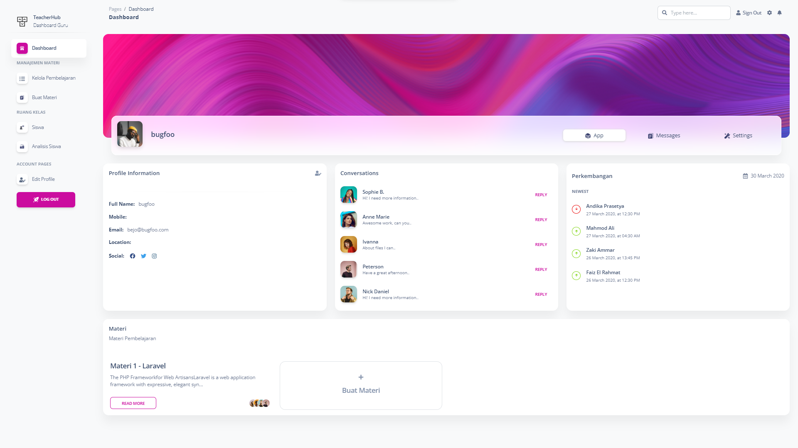

# 🎓 TeacherHub - Hackathon Project



> **Hackathon Task**:  
> Create an educational platform utilizing AI to assist teachers and students.


## 🚀 Project Overview

TeacherHub is an AI-powered platform aimed at helping teachers manage and create educational materials efficiently. Here are the key features and functionalities that are part of the project's goals:

### Features Implemented
- ✅ Teachers can create course material in Markdown format.
- ✅ User profile management (Edit Profile).
- ✅ Authentication system (Login, Sign Up, Logout).

### Features in Progress
- 🔄 AI-powered student performance reports.
- 🔄 Conversations feature.
- 🔄 Assignment submission feature.


## ⚙️ Requirements

To run this project, ensure you have the following tools installed:

- PHP >= 8.1 (make sure PHP is in your environment path)
- Composer
- MySQL


## 🛠️ Setup Instructions

Follow these steps to get the project running locally:

1. **Clone the Repository**  
   Clone this project from the repository.

   ```bash
   git clone <repository-url>
   cd Sevima-TeacherHub-master
   ```

2. **Configure Environment**  
   Rename the `.env.example` file to `.env` and configure the necessary environment variables (database, mail, etc.).

   ```bash
   mv .env.example .env
   ```

3. **Install Dependencies**  
   Install the required PHP dependencies using Composer.

   ```bash
   composer install
   ```

4. **Generate Application Key**  
   Generate the Laravel application key.

   ```bash
   php artisan key:generate
   ```

5. **Run Migrations**  
   Set up the database schema by running the migrations.

   ```bash
   php artisan migrate
   ```

6. **Seed the Database**  
   Populate the database with sample data.

   ```bash
   php artisan db:seed
   ```

7. **Serve the Application**  
   Finally, run the Laravel development server to view the app.

   ```bash
   php artisan serve
   ```


## 📝 Additional Commands

Here are some additional useful commands for development:

- **Run Tests**  
  Run the PHPUnit tests to verify the functionality.

  ```bash
  php artisan test
  ```

- **Clear Cache**  
  Clear the application cache if needed.

  ```bash
  php artisan cache:clear
  ```


## 📚 Learning Resources

If you're new to Laravel or Composer, here are some resources to help you get started:

- [Laravel Documentation](https://laravel.com/docs)
- [Composer Documentation](https://getcomposer.org/doc/)


## 👥 Contributors

We welcome all contributions! Please feel free to submit a pull request or open an issue if you want to contribute.
